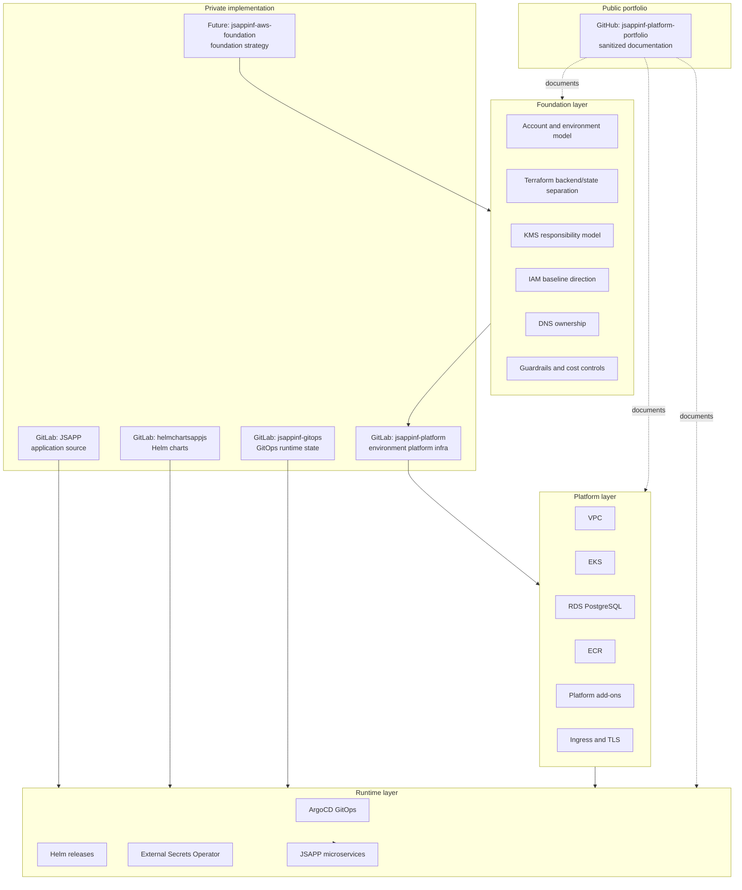

# Foundation and Lightweight Landing Zone Strategy

This document describes the foundation-layer direction for the JSAPPINF platform.

The goal is not to implement a full enterprise AWS Landing Zone immediately, but to define a realistic and phased foundation model that can support future multi-environment and multi-account growth.

---

## Why a Foundation Layer Exists

The platform is intentionally separated into layers.

```text
Application layer
  -> Node.js microservices
  -> application source code
  -> service-level CI/CD

Runtime layer
  -> Helm charts
  -> ArgoCD GitOps
  -> Kubernetes manifests
  -> ExternalSecrets
  -> application deployment state

Platform infrastructure layer
  -> VPC
  -> EKS
  -> RDS
  -> ECR
  -> ingress
  -> cert-manager
  -> External Secrets Operator
  -> monitoring
  -> platform add-ons

Foundation layer
  -> account model
  -> environment strategy
  -> backend/state strategy
  -> baseline IAM/KMS direction
  -> DNS ownership
  -> tagging and naming standards
  -> guardrails
  -> cost and security boundaries
```

The foundation layer answers the question:

```text
Where can platform environments exist, and what baseline rules must they follow?
```

The platform layer answers the question:

```text
What infrastructure does a specific environment need to run workloads?
```

---

## Current State

The current implementation focuses on a working dev platform.

```text
single AWS account
dev-focused environment
Terraform-based infrastructure
EKS platform
RDS PostgreSQL
ArgoCD GitOps
Helm-based microservices
External Secrets Operator
Secrets Manager integration
ingress and TLS
cost-aware rebuild/destroy workflow
```

This is enough to validate the workload and platform flow.

The project already demonstrates:

```text
infrastructure as code
Kubernetes platform setup
GitOps delivery
runtime secrets management
database integration
microservice communication
ingress and TLS
platform troubleshooting
```

---

## Why Not Full Enterprise Landing Zone Immediately

A full enterprise Landing Zone can include:

```text
AWS Organizations
AWS Control Tower
IAM Identity Center
central logging account
security account
shared services account
networking account
SCP guardrails
central audit controls
cross-account access model
Transit Gateway
central DNS and inspection layers
```

Those are valuable in larger organizations, but they are not always needed for an early-stage platform lab.

For this project, implementing all of that immediately would create unnecessary complexity.

The chosen approach is:

```text
start with a working platform
document the foundation direction
separate responsibilities clearly
keep the design ready for future multi-account growth
avoid enterprise overengineering too early
```

---

## Lightweight Foundation Model

The lightweight foundation model focuses on the practical minimum needed for a production-like direction.

It should define:

```text
environment names
account mapping direction
Terraform backend separation
state isolation
naming standards
tagging standards
KMS responsibility model
IAM responsibility boundaries
Secrets Manager path strategy
DNS ownership model
cost-control defaults
basic guardrails
```

This gives the project a clear foundation without requiring full enterprise governance on day one.

---

## Environment Direction

The planned environment model is:

```text
dev
stage
prod-like
```

### dev

Purpose:

```text
daily testing
platform development
experimentation
cost-aware rebuild/destroy workflow
```

Public routing direction:

```text
dev.jsapp365.com
dev.jsapp365.com/api/users
dev.jsapp365.com/api/products
dev.jsapp365.com/api/orders
```

### stage

Purpose:

```text
integration validation
more stable testing
release-style verification
GitOps and platform validation
```

Public routing direction:

```text
stage.jsapp365.com
stage.jsapp365.com/api/users
stage.jsapp365.com/api/products
stage.jsapp365.com/api/orders
```

### prod-like

Purpose:

```text
production-style simulation
cleaner naming
stricter defaults
reduced experimentation
protected resources where appropriate
```

Public routing direction:

```text
jsapp365.com
jsapp365.com/api/users
jsapp365.com/api/products
jsapp365.com/api/orders
```

The production-like public endpoint should not expose labels such as `prod` or `prod-sim` in the user-facing domain name.

Environment identity should remain internal through:

```text
Terraform backend keys
AWS accounts
tags
secret paths
ArgoCD configuration
deployment configuration
```

---

## Account Evolution

The project can start in one AWS account.

A future lightweight multi-account direction could be:

```text
Management account
  -> billing
  -> account administration
  -> future IAM Identity Center

NonProd account
  -> dev
  -> stage
  -> experiments

Prod-like account
  -> production-style simulation
  -> cleaner public routing
  -> stricter resource protection
```

This keeps the model realistic without immediately requiring a full Control Tower deployment.

---

## Terraform State and Backend Separation

Each environment should have separate Terraform state.

Example:

```text
dev:
  envs/dev/infra-next/terraform.tfstate

stage:
  envs/stage/infra-next/terraform.tfstate

prod-like:
  envs/prod-like/infra-next/terraform.tfstate
```

State separation reduces the risk of accidentally modifying the wrong environment.

---

## KMS Responsibility Model

KMS keys should be separated by responsibility, not randomly shared everywhere.

Example responsibility categories:

```text
backend state encryption
database encryption
Secrets Manager encryption
artifact encryption
EKS secrets encryption
application/runtime encryption
```

This keeps ownership and blast radius clearer.

---

## IAM Responsibility Direction

IAM should follow least privilege and ownership boundaries.

The foundation layer may define baseline IAM direction.

The platform layer may define environment-specific IAM and IRSA roles.

Examples:

```text
External Secrets Operator IRSA
cert-manager Route 53 permissions
external-dns Route 53 permissions
EBS CSI permissions
Lambda or DB provisioning roles
GitOps deployment access boundaries
```

IAM should not be centralized too early if it makes the project harder to evolve, but the responsibility model should be documented.

---

## Secrets Strategy

Secrets should not be stored directly in Git repositories.

The runtime secret flow is:

```text
AWS Secrets Manager
  -> External Secrets Operator
  -> Kubernetes Secret
  -> application pod
```

Secret paths should be environment-specific.

Example:

```text
jsappinf/dev/app/db/ui-service
jsappinf/stage/app/db/ui-service
jsappinf/prod-like/app/db/ui-service
```

This prevents accidental reuse of credentials between environments.

---

## DNS Ownership Model

The foundation layer should define the high-level DNS ownership model.

The platform layer can implement environment-specific records.

Target public routing:

```text
dev.jsapp365.com
stage.jsapp365.com
jsapp365.com
```

Backend services should be exposed through path-based routing:

```text
/api/users
/api/products
/api/orders
```

Individual service subdomains may exist temporarily for lab/debugging, but they should not be the long-term production-like public model.

---

## Guardrails

Initial lightweight guardrails:

```text
no raw secrets in Git
separate Terraform state per environment
environment-specific secret paths
cost-aware dev defaults
deletion protection only where appropriate
clear public/private repository separation
documented KMS responsibility
documented IAM ownership
clean production-like DNS naming
```

Later guardrails may include:

```text
SCP policies
central logging
central security account
IAM Identity Center
Control Tower
AWS Config
CloudTrail organization trail
security hub baseline
```

Those are future extensions, not required for the first working platform phase.

---

## Mermaid Diagram



---

## Interview Summary

The project intentionally uses a phased approach.

```text
Phase 1:
  build a working dev platform

Phase 2:
  document and standardize multi-environment direction

Phase 3:
  define lightweight foundation and account strategy

Phase 4:
  add production-like operational scenarios such as EKS upgrades

Phase 5:
  optionally evolve toward multi-account Landing Zone patterns
```

The key idea is:

```text
Do not overbuild enterprise governance too early.
Build a real platform first.
Separate responsibilities clearly.
Keep a documented path toward stronger foundation and Landing Zone practices.
```

---

## Portfolio Value

This strategy shows that the project is not only a collection of Terraform and Kubernetes resources.

It demonstrates platform engineering thinking:

```text
layered architecture
environment lifecycle
account strategy
state isolation
security boundaries
secret ownership
public/private repository separation
cost-aware growth
future landing-zone readiness
```
