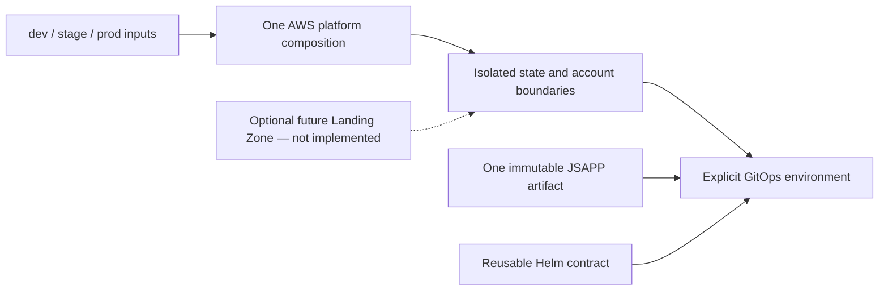

# Phase 1 status and evidence

## CURRENT / VALIDATED

Historical DEV evidence in the source portfolio covers AWS EKS, PostgreSQL integration, Gateway routing, RabbitMQ delivery, Cognito and Karpenter experiments. It is dated source/operator evidence, not a fresh live inventory. The source records DEV runtime intentionally OFF as of 2026-09-17. Later authentication/session/credential acceptance remains subject to its original evidence limits.

## IMPLEMENTED CANDIDATE / NOT DEPLOYED

The local Phase 1 candidate extracts one reusable AWS composition, explicit DEV/STAGE/PROD inputs, isolated backend templates and account/context selection. GitOps has three environment directories; stage/prod roots are disabled and migration gates block workloads. Existing charts gained optional immutable digest selection; application builds are unchanged.

Credential-free validation passed Terraform formatting and isolated input validation, 12 Helm lint/template combinations, YAML/Argo structural checks and DEV render equivalence. An exact-tag Docker/Linux probe ran `terraform init -backend=false` plus `terraform validate` against the reusable `stacks/aws/platform` root using exact local snapshots of the four pinned `terraform-modules` tags; it passed provider-backed syntax and module-interface validation, but did not validate a backend, state, cloud APIs or historic DEV inputs. Native `kubectl kustomize` evidence covers 40 roots: 38 expected-nonempty roots render resources and the two exact historical migration roots `environments/dev/apps/ui-session-migration` and `environments/dev/apps/user-service-migrations` intentionally render zero. This is Kustomize render evidence, not Kubernetes schema validation. Kubeconform remains blocked by schema retrieval and is not a pass. No stage/prod infrastructure, backend, secrets, image publication or deployment was verified. Original private DEV variables/state/backend must be reconciled before migration.

## TARGET / PROPOSED

Stage/prod live rollout, production recovery/availability evidence, further shared-module contracts and stronger edge controls remain future work. Landing Zone is an optional later attachment; AWS Organizations, Control Tower, a foundation repository/contracts, Azure and GCP JSAPPINF are not implemented or required by Phase 1. Cross-cloud remains an untouched capability catalog.

One composition serves independently selected environments while repository ownership stays intact. No canonical repository or cloud resource was mutated during candidate implementation.

