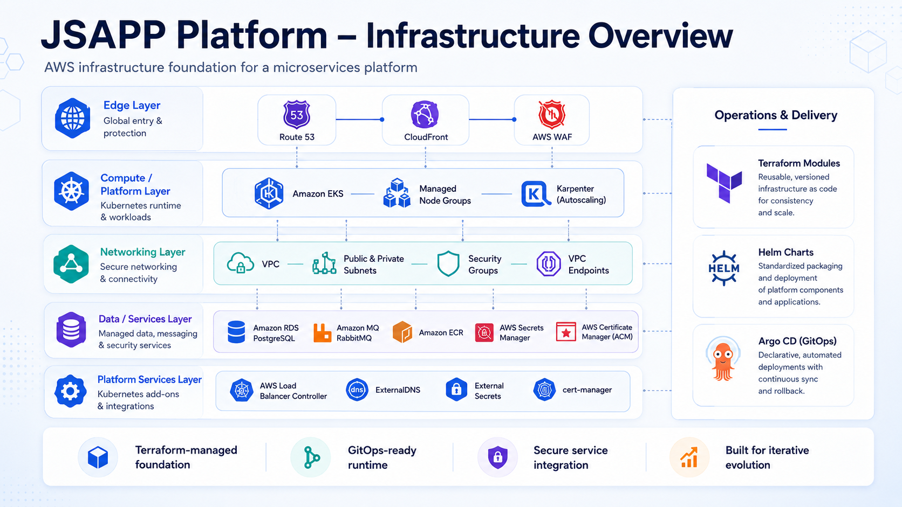
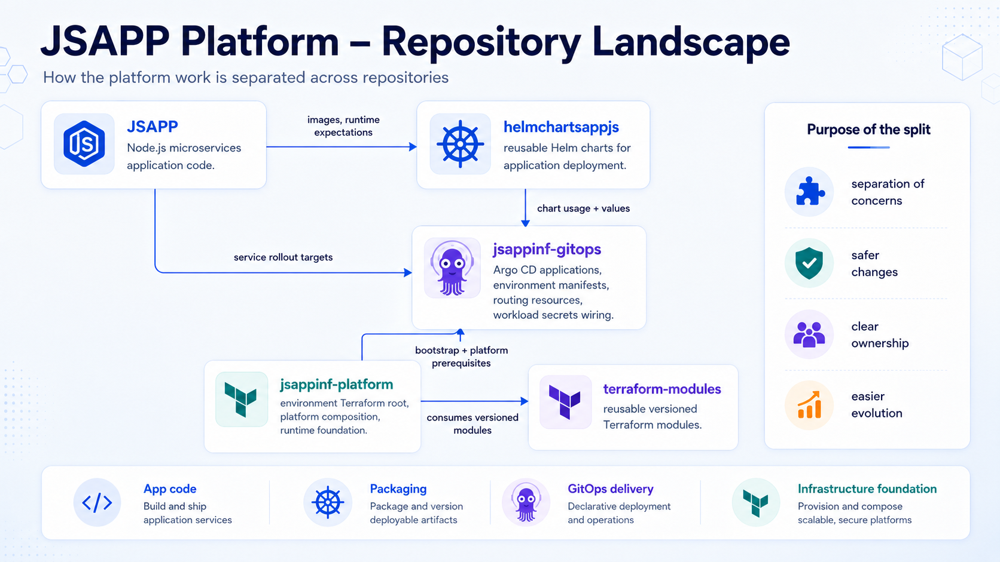
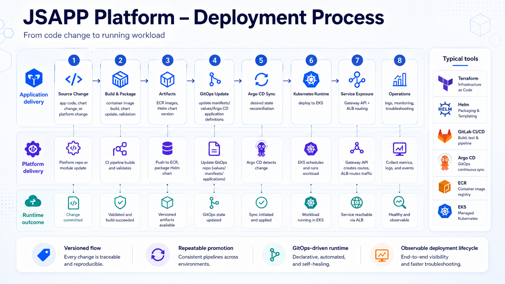
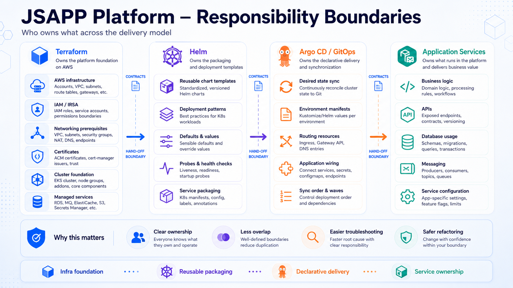
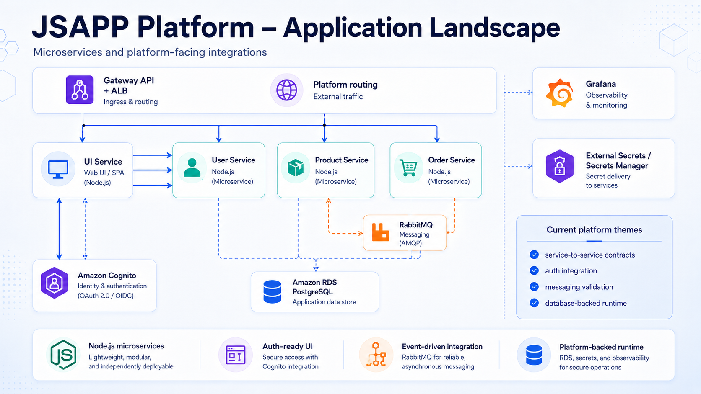

# JSAPP Platform Visual Overview

This page provides a visual summary of the JSAPP platform architecture, repository model, delivery process, ownership boundaries and application landscape.

The diagrams combine validated platform capabilities with clearly identified target-state and work-in-progress areas.

As of 2026-09-17, DEV runtime is intentionally OFF for cost control. Runtime descriptions below refer to source configuration or previously validated capabilities, not currently running workloads. The images are conceptual reference views; their labels do not establish acceptance of newer source changes.

## Infrastructure Overview



The image’s “continuous sync and rollback” label describes a delivery capability, not proven automatic rollback or current reconciliation while DEV is OFF.

### Status

Previously validated capabilities (not the currently retained foundation):

- AWS VPC and subnet design
- Amazon EKS and managed node groups
- Karpenter-based capacity model
- Amazon RDS PostgreSQL
- Amazon MQ RabbitMQ
- Amazon ECR
- AWS Secrets Manager
- AWS Load Balancer Controller
- ExternalDNS
- External Secrets
- cert-manager
- Terraform, Helm and Argo CD delivery boundaries

Target edge direction:

```text
Internet
→ Route 53
→ CloudFront
→ AWS WAF
→ Application Load Balancer
→ Gateway API
→ HTTPRoute
→ Kubernetes Service
```

Long-running CloudFront and AWS WAF exposure remains intentionally disabled in the development environment.

## Repository Landscape



### Status

Current repository ownership model:

- `JSAPP` owns application source code and service runtime behavior.
- `helmchartsappjs` owns reusable Helm packaging.
- `jsappinf-gitops` owns Argo CD desired state and environment delivery.
- `jsappinf-platform` owns environment composition and AWS platform infrastructure.
- `terraform-modules` owns reusable and versioned infrastructure modules.

This separation reduces overlap and keeps application, packaging, GitOps and infrastructure responsibilities explicit.

## Deployment Process



### Status

Reference end-to-end delivery model:

```text
Source change
→ build and validation
→ versioned artifact
→ GitOps desired-state update
→ Argo CD synchronization
→ Kubernetes runtime
→ service exposure
→ operational validation
```

The exact path depends on the type of change.

Application image changes, Helm chart changes and Terraform platform changes do not always use identical pipelines, but they follow the same principles of versioning, validation and controlled promotion.

The diagram simplifies these paths: Terraform infrastructure changes are applied through the infrastructure workflow, not delivered as ECR images through Argo CD. Artifact readiness does not establish live promotion; DEV is currently OFF.

## Responsibility Boundaries



### Status

Current architectural ownership standard:

- Terraform owns AWS infrastructure, IAM, networking and managed-service prerequisites.
- Helm owns reusable Kubernetes templates and deployment packaging.
- Argo CD and GitOps own declarative environment delivery and synchronization.
- Application services own business logic, APIs, database usage and messaging behavior.

These boundaries support safer changes, clearer troubleshooting and more controlled platform evolution.

Terraform also owns the controller Helm releases listed in the [responsibility matrix](component-responsibility-matrix.md), including Argo CD itself. Parent sync waves alone do not prove child completion: C01 uses immutable migrations and per-workload PreSync gates requiring full Application sync. The image’s ElastiCache label is a generic managed-service example, not an implemented JSAPPINF component.

## Application Landscape



The UI uses server-rendered EJS views; the image’s “SPA” label is inaccurate. RabbitMQ is a managed Amazon MQ broker and does not use the application RDS database. The previously validated messaging scope is order-service publishing `order.created` to the product-service consumer; the image’s “reliable” label does not imply a transactional outbox or durable business processing.

### Status

Validated application capabilities:

- UI, user, product and order services
- PostgreSQL-backed runtime
- RabbitMQ `order.created` publisher and consumer flow
- secret delivery through External Secrets and AWS Secrets Manager
- Gateway API and ALB routing direction
- platform monitoring integration

Work in progress:

- live acceptance of current source-implemented Cognito integration and B03 session/request hardening; B03b cross-replica revocation remains deferred
- current end-to-end authenticated user acceptance
- live revalidation of configured app.dev and api.dev routing when DEV is restored
- additional RabbitMQ events, retries and dead-letter handling

## Summary

The platform is intentionally split into clear layers:

```text
Application code
→ reusable packaging
→ GitOps desired state
→ Kubernetes runtime
→ AWS infrastructure foundation
```

The visual models are designed to explain both the current validated platform and the direction of its ongoing evolution.
